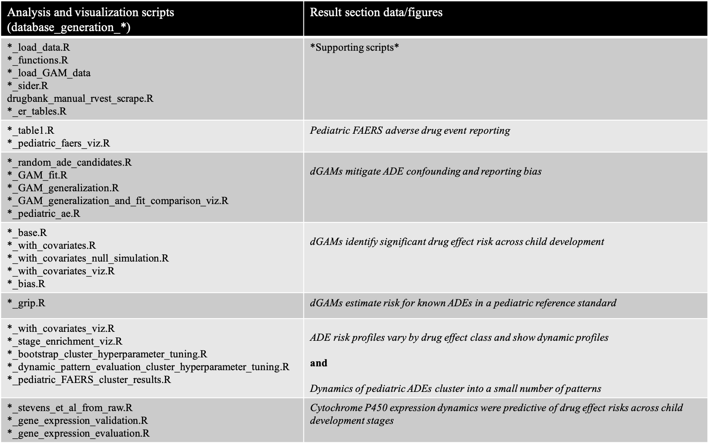

# Pediatric Adverse Drug Event Database study

This is the repository for the code associated with the manuscript: "A database of pediatric drug effects to evaluate ontogenic mechanisms from child growth and development"

The scripts were run on either a 16GB RAM/4 CPU Macbook or on a 64GB RAM/60 CPU server. The code in the scripts were run interactively and their outputs are closely tied to the data and figures from the results sections in the paper shown here:

